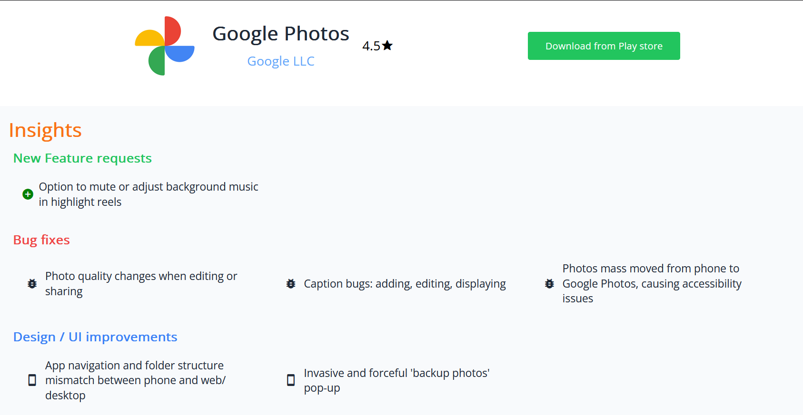

# Play Monitor


### [View Live](https://playmonitor.vercel.app/)

## About

Play Monitor is a full stack web application developed to help app development teams to gain insights from user reviews on new feature requests, bug issues and Design improvements.

## Features

### 1. Receive search recommendations as you type ⌨️


### 2. Discover millions of apps and Games available on Google Play Store. 🔎


### 3. Explore similar applications and games suggestions. 🎮


### 4. Gain insights from user reviews on new feature requests, bug issues and Design improvements. 📊



## Installation

- Clone the repository and install the dependencies.

```bash
git clone https://github.com/Santhoshmani1/Play-Monitor.git
cd Play-Monitor
npm install
npm run dev
```

- The application will be running on `http://localhost:/5173`

## Tech Stack

### Frontend

- The Frontend of the web application is built using 
    - [React.js](https://www.reactjs.dev) - A JavaScript library for building user interfaces. 
    - [Tailwind CSS](https://tailwindcss.com) - A utility-first CSS framework for quickly building custom designs.
    - [Google Material Icons](https://fonts.google.com/icons) - Material icons are delightful, beautifully crafted symbols for common actions and items.

### Backend
- The backend of the application is built using 
    - [Node.js](https://nodejs.org/en/) - A JavaScript runtime built on Chrome's V8 JavaScript engine.
    - [Express.js](https://expressjs.com) - Fast, unopinionated, minimalist web framework for Node.js.
    - Hosted on [vercel](https://www.vercel.com).

### APIs
The web application is built on top of 2 Restful APIs

1. [G-Play reviews API](https://www.github.com/Santhoshmani1/gplay-reviews-api)
    - G-Play reviews API is a Restful API implementation of the npm package [google-play-scraper](https://npmjs.com/package/google-play-scraper) in node.js & express.js
    - The API is used to fetch the app details, reviews, ratings, similar apps and more from the Google Play Store. Full documentation can be found [here](https://github.com/Santhoshmani1/gplay-reviews-api#)
    

2. [Gemini AI API](https://github.com/Santhoshmani1/Play-monitor/blob/main/GoogleAI-api) 
    - A Restful API to fetch the insights from the user reviews on new feature requests, bug issues and Design improvements.
    - The API is integrated with Google Gemini 1.5 pro model & is prompted to analyse the user reviews and provide insights.


## LICENSE

MIT License
